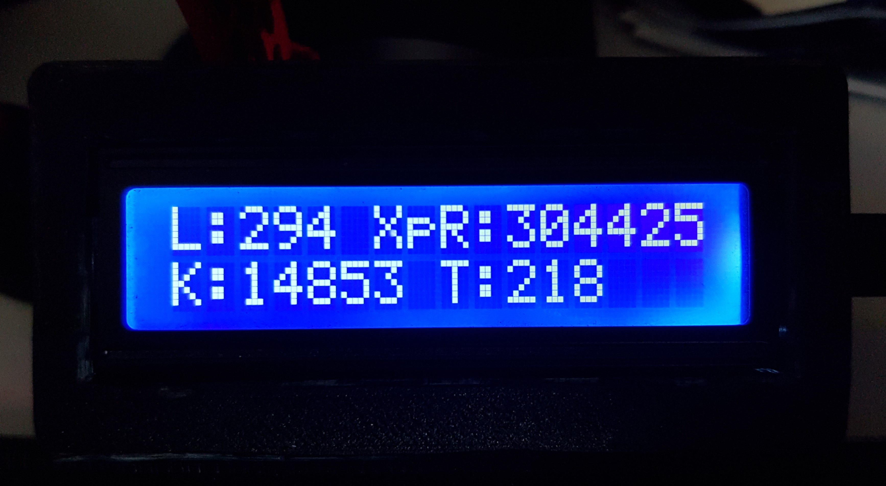

# SplitgateStats - ESP32 based Splitgate API display

This is an ESP32 based project for polling and displaying player information for Splitgate by 1027 Games.
The ESP32 will get and display player information publicly available from tracker.gg

The display with show live Kills, XP till pro level 3, total kills and total teabags!

In the Platform.IO project included in this repo, I have used an ESP32-CAM board.
You will need to edit the platformio.ini settings as well as defining you own settings in UserConfig.hpp
